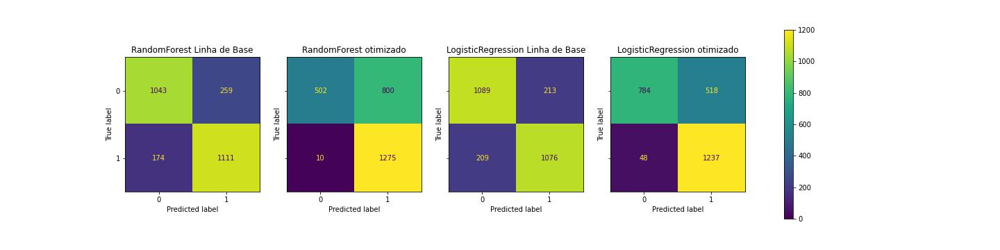

# Primeiro Challenge-DataScience-Alura

## INFORMAÇÕES GERAIS

**EMPRESA**:  operadora de telecomunicações **Alura Voz**. 

**OBJETIVO**: reduzir a **Churn Rate**, ou Taxa de Evasão de Clientes. 

**COMO FAZER**: Identificar os clientes que teriam uma maior chance de deixar a empresa. A ideia é criar um modelo de **Machine-Learning** para encontrar padrões nas características de clientes e/ou dos planos contratados para **CLASSIFICAR** estas pessoas com maior probabilidade de deixar a empresa ou não. 

## 01 - Limpeza e pré-tratamento dos dados

O arquivo de [dados](Dados/Telco-Customer-Churn.json) foi disponibilizados via API em formato JSON, com informações dos clientes descritas a seguir:
- *customerID:* número de identificação único de cada cliente
- *Churn:* se o cliente deixou ou não a empresa
- *gender:* gênero (masculino e feminino)
- *SeniorCitizen:* informação sobre um cliente ter ou não idade igual ou maior que 65 anos
- *Partner:* se o cliente possui ou não um parceiro ou parceira
- *Dependents:* se o cliente possui ou não dependentes
- *tenure:* meses de contrato do cliente
- *PhoneService:* assinatura de serviço telefônico
- *MultipleLines:* assisnatura de mais de uma linha de telefone
- *InternetService:* assinatura de um provedor internet
- *OnlineSecurity:* assinatura adicional de segurança online
- *OnlineBackup:* assinatura adicional de backup online
- *DeviceProtection:* assinatura adicional de proteção no dispositivo
- *TechSupport:* assinatura adicional de suporte técnico, menos tempo de espera
- *StreamingTV:* assinatura de TV a cabo
- *StreamingMovies:* assinatura de streaming de filmes
- *Contract:* tipo de contrato
- *PaperlessBilling:* se o cliente prefere receber online a fatura
- *PaymentMethod:* forma de pagamento
- *Charges.Monthly:* total de todos os serviços do cliente por mês
- *Charges.Total:* total gasto pelo cliente

O arquivo de dados foi limpo e verificado, excluindo informações faltantes que pudessem prejudicar o desenvolvimento do modelo. Tambémn foram corrigidas as inconsistências. Além disso, os valores em formato *sting* e *object* foram traduzidos para valores numéricos para facilitar a implemtentação de modelos de Machine Learnig posteriormente.

O desenvolvimento desta primeira etapa está descrita e explicada neste [notebook](1-Limpeza-dos-dados.ipynb), a partir do qual foi gerado o [arquivo](Dados/01-Telco-Customer-Churn-dados-limpos.csv) com os dados limpos e tratados.

## 02 - Análise Exploratória e Visualização dos Dados

Foi desenvolvida uma detalhada análise exploratória para entender melhor o perfil pessoal dos clientes, tipos de contratos e serviços e como cada uma dessas variáveis se relaciona com a variável **target** que é a Evasão dos clientes. A análise completa está neste [notebook](2-Analise-Exploratoria-e-Visualizacao.ipynb) e  como principais conclusões, temos: 
- Alta evasão entre os clientes que tem serviço de fibra ótica, sendo as possíveis causas que podemos imaginar: qualidade do serviço e também o valor elevado.
- Clientes mais recentes também tendem a cancelar mais suas assinaturas.
- Clientes com tipo de contrato mês-a-mês possuem evasão bastante alta, porém isso pode ser explicado facilmente, caso haja multa para quebra de contrato de 1 ou 2 anos. A maior parte dos clientes mais antigos possuem tipo de contrato Bianual. Não se pode saber se estes mesmo clientes cancelariam hoje o plano se tivessem um contrato mês-a-mês ou se renovariam. Seria necessário uma análise temporal para entender quantos desses clientes antigos renovaram seus planos recentemente, e quantos permanecem clientes apenas porque não podem cancelar tão facilmente.

## 03 - Modelo Machine Learning para Classificação

Foram treinados e testados 5 modelos diferentes de Machine Learning para **classificar** os clientes que cencelariam seus serviços ou não (Linear SVC, Logistic Regression, K-Nearest Neighbors, Random Forest, Decision Tree). Posteirormente foram analisadas respectivas métricas e resultados e otimizados os modelos que apresentaram melhor desempenho.

Do ponto de vista do nosso problema de negócio, precisamos identificar os clientes que tem mais chances de cancelar o plano, para que a empresa possa ter ações de retenção direcionadas para estes clientes, com o objetivo de reduzir a *Churn Rate*.

Portanto, a taxa de **Recall**, neste caso, é a métrica mais importante, uma vez que desejamos obter um modelo com maior número de Verdadeiros Positivos e menor quantidade de Falsos Negativos. Enquanto que, uma proporção maior de Falsos Positivos não seria tão prejudicial para a empresa.

Em outras palavras, o objetivo é identificar corretamente o maior número de os clientes que pretendem cancelar o plano, e se caso o modelo identifique alguns clientes como potencial cancelamento, mas que na verdade são clientes que pretendem continuar com os serviços, este "erro" não acarretria em grandes problemas. Pelo contrário, estes clientes que são Falsos Positivos poderão até serem beneficiados com as possíveis ações de retenção de clientes, ganhando mais benefícios, gerando, consequentemente, ainda mais satisfação entre os clientes que já estavam satisfeitos.

Ao comparar os resultados dos modelos iniciais com os modelos otimizados, percebe-se que houve uma melhora significativa na métrica **Recaal**, que passou de 86,4% para 99,2% no modelo Random Forest e de 83,7% para 96,1% no modelo Logistic Regression, sendo que este último, ainda manteve as demais métricas acima de 70%.

Além disso, a Curva ROC e AUC do modelo Logistic Regression também permaneceu mais adequado em comparação com o RF.

  

Sendo assim, o modelo indicado para Classificar nossos clientes e reduzir a *Churn Rate* é o modelo de **Logistic Regression**.
O desenvolvimento e análise dos modelos de Machine Learing completos  está no [notebook](3-Machine-Learning-para-Classificacao.ipynb).
